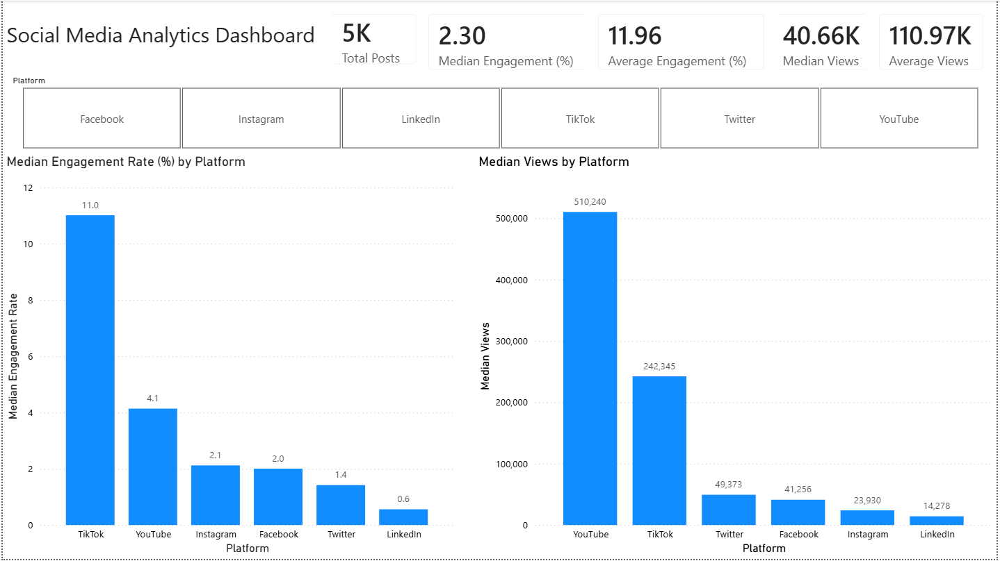
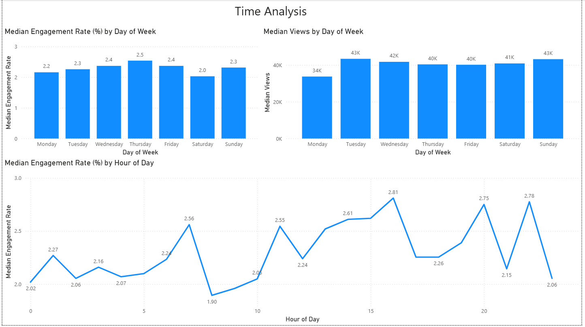
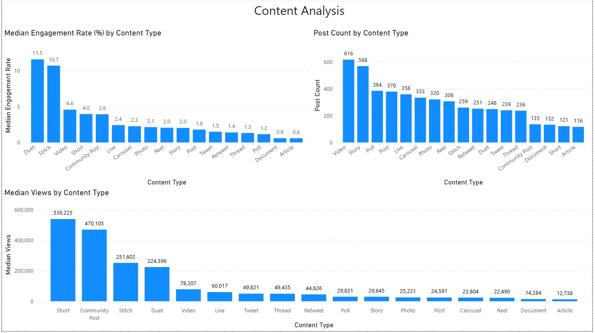

# Social Media Engagement Analysis
## Project Overview

In this project, I analyzed 5,000 social media posts to explore what drives engagement and views across different platforms and content types.

I looked at how performance changed by platform, content type, day of the week, and time of day. I also compared averages with medians and found that some high-performing posts were pulling the averages up, so I focused more on medians to understand what typical performance looked like.

I then built a Power BI dashboard to bring the analysis together and highlight the main patterns I found.

## Tools Used

- **Excel** – Data exploration and analysis
- **Power BI** – Dashboard creation and data visualization

## Dashboard Overview

### Key Insights

- **TikTok and YouTube stood out across platforms:** TikTok had the highest median engagement rate at approximately 11%, while YouTube had the highest median views at approximately 510K.

- **Average performance was substantially higher than typical performance:** Average views were about 111K compared with a median of about 41K, suggesting that a smaller number of high-performing posts pulled the average upward.

- **Engagement showed a similar pattern:** Average engagement was about 12%, compared with a median of only 2.3%. Because of this large difference, median engagement was used to better represent typical performance.

## Time Analysis

### Key Insights

- **Engagement remained relatively consistent throughout the week:** Median engagement stayed between approximately 2% and 2.5%, with Thursday performing the best and Saturday the lowest.

- **Monday was noticeably weaker for views:** Median views on Monday were around 34K, while the rest of the week generally remained around 40K–43K.

- **Engagement varied more noticeably by time of day:** The largest peak occurred around 4 PM, with additional spikes around 8 PM and 10 PM.

## Content Analysis

### Key Insights

- **Duets and Stitches performed especially well for engagement:** Their median engagement rates were approximately 11.5% and 10.7%, while every other content type was below 5%.

- **Posting more frequently did not necessarily result in stronger engagement:** Video and Story were the most common content types, but Duet and Stitch achieved much higher median engagement despite being posted less frequently.

- **Shorts stood out for views:** Shorts had approximately 539K median views, followed by Community Posts at approximately 470K. Stitch and Duet were also strong at roughly 252K and 224K.

- **Stitch and Duet performed strongly across multiple metrics:** Both had relatively high median views and median engagement, making them two of the more notable content types in the dataset.
